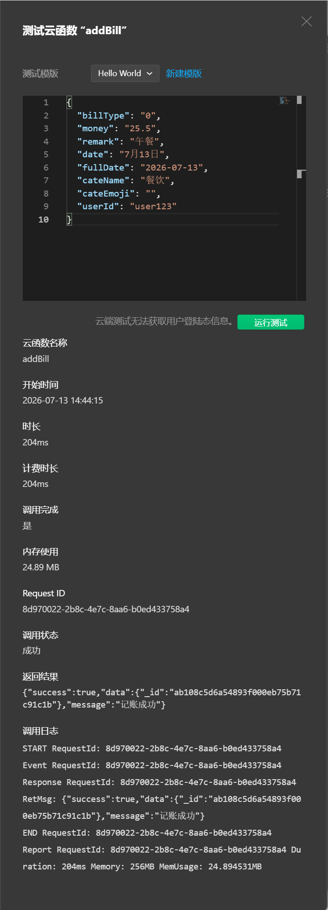
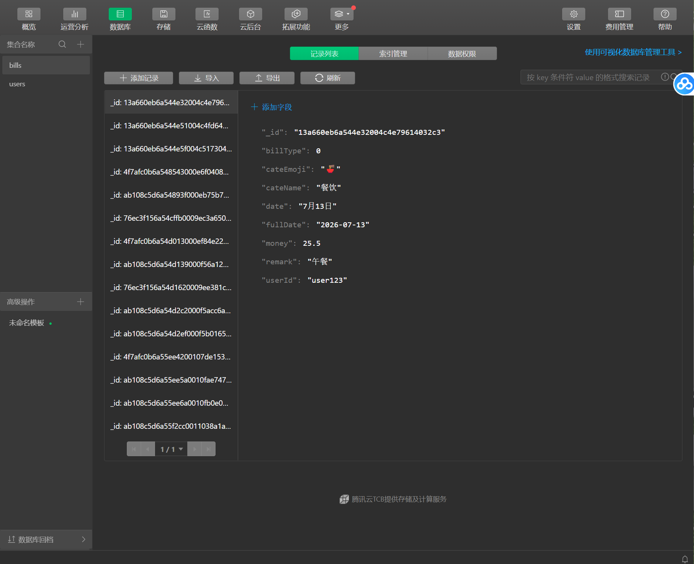
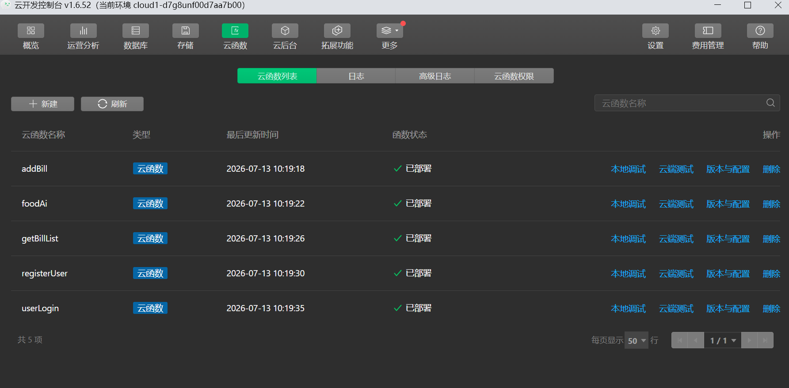

# 冰冰记账本 - 微信小程序

一款基于微信小程序原生开发的个人财务管理应用，支持智能记账、数据统计、预算管理、存钱挑战、AI食物识别、AI智能分类、AI理财助手等功能。

## 🌐 线上访问

### 微信小程序体验版（推荐）
使用微信扫码体验小程序：


> ⚠️ 该二维码7月25日前有效

### 视频演示
已上传项目功能演示视频至百度网盘，包含完整的功能展示：

| 项目 | 链接 |
|------|------|
| **演示视频** | [记账本视频演示.mp4](https://pan.baidu.com/s/1A9fpWcl0RT4IoiPAEGXrAQ?pwd=9hg3) |
| **提取码** | `9hg3` |

### 本地部署
详细部署步骤请参考 [DEPLOYMENT.md](./DEPLOYMENT.md)

## 📁 项目结构

```
account book app/
├── app.js                    # 应用入口，云开发初始化
├── app.json                  # 应用配置
├── app.wxss                  # 全局样式
├── pages/                    # 页面目录（30+页面）
│   ├── index/                # 首页仪表盘
│   ├── addbill/              # 记账页面
│   ├── statistics/           # 统计页面
│   ├── mine/                 # 个人中心
│   ├── login/                # 登录页面
│   ├── register/             # 注册页面
│   ├── budget/               # 预算管理
│   ├── saveChallenge/        # 存钱挑战
│   ├── asset/                # 资产管理
│   ├── classify/food/        # 餐饮手账+AI识别
│   ├── ai-assistant/         # AI理财助手
│   └── ...                   # 其他页面
├── cloudfunctions/           # 云函数目录
│   ├── addBill/              # 添加账单
│   ├── getBillList/          # 获取账单列表
│   ├── userLogin/            # 用户登录
│   ├── registerUser/         # 用户注册
│   └── foodAi/               # AI食物识别
├── utils/
│   └── db.js                 # 数据库封装工具（云/本地双模式）
├── images/                   # 图标资源
├── screenshots/              # 项目截图
│   ├── api_*.png             # API接口截图
│   ├── database_*.png        # 数据库截图
│   └── cloudfunctions.png    # 云函数截图
├── food-ai-server/           # AI识别后端服务（Express）
├── README.md                 # 项目说明
├── API文档.md                # API接口文档
├── DEPLOYMENT.md             # 部署说明文档
├── prompt_log.md             # AI使用日志
├── AI_Code_Review_Report.md  # AI代码审查报告
└── 个人实训总结报告.md        # 实训总结
```

## 🛠️ 技术栈

| 技术 | 说明 |
|------|------|
| 微信小程序原生 | WXML + WXSS + JavaScript + JSON |
| 微信云开发 | 云函数 + 云数据库 + 云存储 |
| u-charts | 数据可视化图表库 |
| Express | AI识别后端服务框架 |
| 百度AI开放平台 | 食物识别API |
| 本地存储 | wx.getStorageSync/setStorageSync |

## 🚀 快速开始

### 环境要求

- 微信开发者工具（版本 1.05 以上）
- 微信小程序基础库 2.2.3 以上
- Node.js（可选，用于启动AI识别后端服务）

### 安装步骤

1. **下载源码**
   ```bash
   git clone https://github.com/Yanghb1202/ice-account-book.git
   cd "account book app"
   ```

2. **配置云开发环境**
   - 打开微信开发者工具
   - 在云开发控制台创建云环境
   - 将 `app.js` 中的 `env` 替换为你的云环境 ID

3. **创建云数据库集合**
   在云开发控制台创建以下集合：
   - `bills` - 账单数据
   - `users` - 用户数据

4. **上传云函数**
   - 在微信开发者工具中右键云函数目录
   - 选择"上传并部署：云端安装依赖"

5. **运行项目**
   - 在微信开发者工具中点击"编译"
   - 使用微信扫码预览

### 本地开发模式

项目支持云开发和本地存储两种模式，通过 `utils/db.js` 中的 `useCloud` 变量切换：

```javascript
const useCloud = false  // false=本地存储模式，true=云开发模式
```

### 启动AI识别后端服务（可选）

```bash
cd food-ai-server
npm install
npm start
```

服务启动后访问 http://localhost:3000/health 验证

## 📡 API 文档

### 云函数接口

#### 1. userLogin - 用户登录

**请求参数**
```json
{
  "phone": "15060723962",
  "password": "123456"
}
```

**响应示例**
```json
{
  "success": true,
  "data": {
    "userId": "abc123",
    "phone": "13800138000",
    "nickname": "张三"
  },
  "message": "登录成功"
}
```

#### 2. registerUser - 用户注册

**请求参数**
```json
{
  "phone": "13800138000",
  "password": "123456",
  "nickname": "张三"
}
```

**响应示例**
```json
{
  "success": true,
  "data": {
    "userId": "abc123",
    "phone": "13800138000",
    "nickname": "张三"
  },
  "message": "注册成功"
}
```

#### 3. addBill - 添加账单

**请求参数**
```json
{
  "billType": 0,
  "money": 25.50,
  "remark": "午餐",
  "date": "7月12日",
  "fullDate": "2026-07-12",
  "cateName": "餐饮",
  "cateEmoji": "🍜",
  "userId": "abc123"
}
```

**响应示例**
```json
{
  "success": true,
  "message": "记账成功"
}
```

#### 4. getBillList - 获取账单列表

**请求参数**
```json
{
  "userId": "abc123",
  "startDate": "2026-07-01",
  "endDate": "2026-07-31",
  "billType": 0,
  "page": 1,
  "pageSize": 20
}
```

**响应示例**
```json
{
  "success": true,
  "data": [...],
  "total": 100,
  "message": "查询成功"
}
```

#### 5. foodAi - AI食物识别

**请求参数**
```json
{
  "fileID": "cloud://xxx/xxx.jpg"
}
```

**响应示例**
```json
{
  "success": true,
  "data": {
    "foodName": "汉堡",
    "calories": 450,
    "confidence": 92,
    "tip": "建议搭配蔬菜沙拉"
  },
  "message": "识别成功"
}
```

### HTTP 接口（Express后端）

#### POST /api/recognize - 食物图片识别

上传食物图片进行AI识别，返回食物名称和热量信息。

**完整API文档**请参考 [API文档.md](./API文档.md)

## ✨ 核心功能

| 功能模块 | 说明 |
|---------|------|
| 首页仪表盘 | 动态问候、收支概览、账单流、预算提醒、存钱挑战 |
| 智能记账 | 计算器键盘、分类选择、快捷备注 |
| AI智能分类 | 输入备注自动推荐消费分类 |
| 数据统计 | 折线图、环形图、AI消费趋势预测 |
| 预算管理 | 月度预算、分类预算、进度追踪 |
| 存钱挑战 | 储蓄目标、进度追踪、记录时间线 |
| 餐饮手账 | 周历视图、AI食物识别、热量统计 |
| AI理财助手 | 消费习惯分析、个性化理财建议、省钱目标推荐 |
| 用户体系 | 登录注册、个人中心、设置 |
| 资产管理 | 资产总览、分类统计 |

## 🤖 AI 功能模块

### 1. AI智能分类
- 基于关键词匹配算法
- 支持10+消费分类
- 实时推荐，提升记账效率

### 2. AI消费趋势预测
- 基于历史数据分析
- 预测剩余天数消费
- 提供智能分析建议

### 3. AI理财助手
- 消费习惯深度分析
- 个性化理财建议
- 省钱目标推荐
- 预算预测功能

### 4. 餐饮AI识别
- 百度AI食物识别API
- 食物热量计算
- 健康饮食建议
- 支持模拟数据降级

## 📄 数据库结构

### bills 集合
```json
{
  "_id": "自动生成",
  "billType": 0,
  "money": 25.50,
  "remark": "午餐",
  "date": "7月12日",
  "fullDate": "2026-07-12",
  "cateName": "餐饮",
  "cateEmoji": "🍜",
  "userId": "abc123",
  "createTime": "服务器时间"
}
```

### users 集合
```json
{
  "_id": "自动生成",
  "phone": "13800138000",
  "password": "密码",
  "nickname": "张三",
  "avatar": "",
  "createTime": "服务器时间"
}
```

## 📝 开发日志

项目使用 Git 进行版本管理，提交记录遵循 Conventional Commits 规范：

```
init: 初始化项目
feat: 添加新功能
fix: 修复bug
refactor: 重构代码
docs: 更新文档
style: 样式调整
```

## � 项目截图

| API接口截图 | 数据库截图 | 云函数截图 |
|------------|-----------|-----------|
|  |  |  |

更多截图请查看 [screenshots/](./screenshots) 目录

## 📅 开发进度

- 7月11日：项目初始化
- 7月12日：首页仪表盘和记账页面开发完成
- 7月13日：用户体系和个人中心开发完成，云函数开发
- 7月14日：统计分析和分类管理开发完成，AI功能集成
- 7月15日：预算管理、存钱挑战、资产管理等扩展功能开发完成，项目优化收尾，文档完善
- 7月18日：完善项目文档，更新README和实训总结报告

## 📚 文档清单

| 文档 | 说明 |
|------|------|
| [README.md](./README.md) | 项目说明文档 |
| [API文档.md](./API文档.md) | 完整API接口文档 |
| [DEPLOYMENT.md](./DEPLOYMENT.md) | 部署说明文档 |
| [prompt_log.md](./prompt_log.md) | AI使用日志记录 |
| [AI_Code_Review_Report.md](./AI_Code_Review_Report.md) | AI代码审查报告 |
| [个人实训总结报告.md](./个人实训总结报告.md) | 实训总结报告 |

## 📮 联系方式

如有问题或建议，欢迎反馈！

**项目地址**：https://github.com/Yanghb1202/ice-account-book
